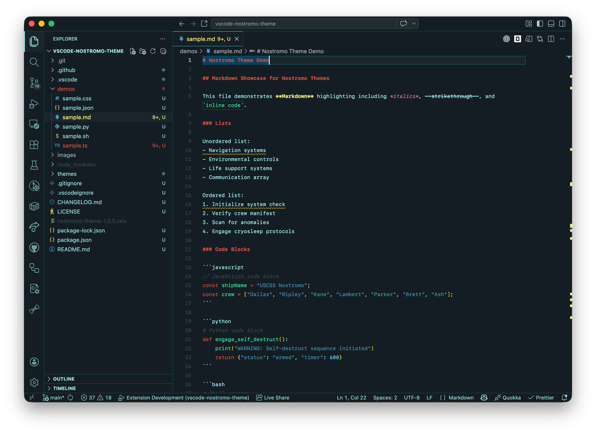
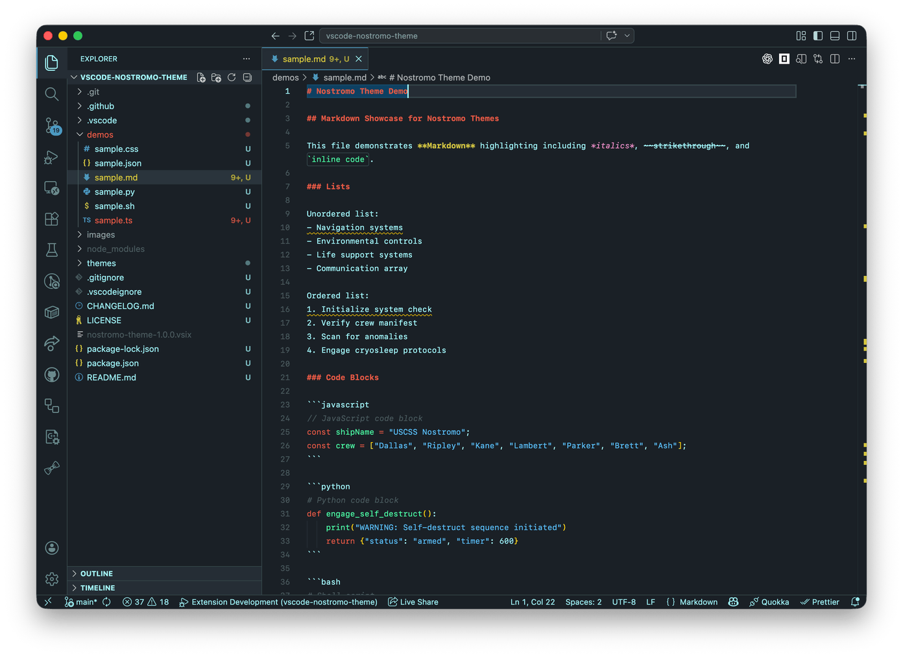
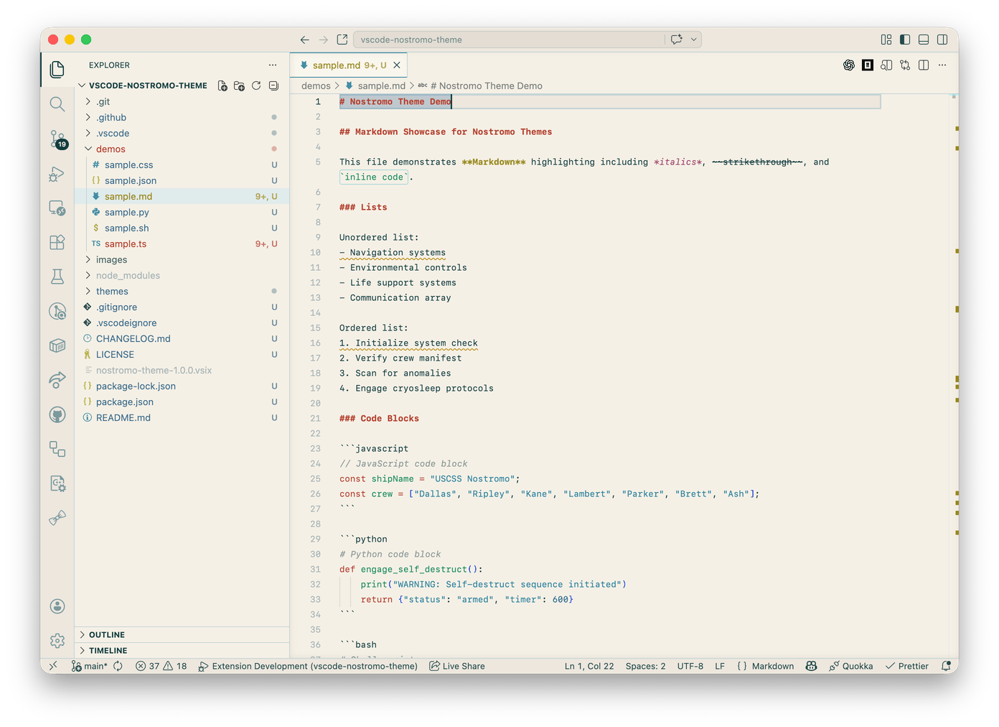
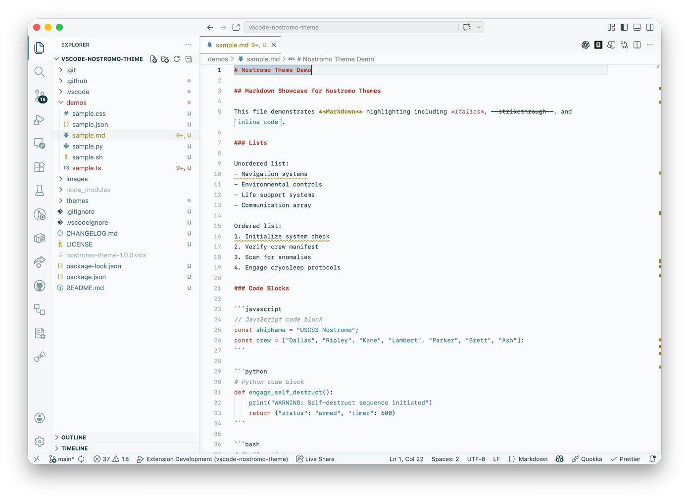

# Nostromo Theme Pack

A retro-futuristic VS Code theme pack featuring four meticulously crafted variants, inspired by the Nostromo spacecraft UI from the 1979 film _Alien_.

[](https://marketplace.visualstudio.com/items?itemName=grikomsn.nostromo-theme-pack)
[](https://marketplace.visualstudio.com/items?itemName=grikomsn.nostromo-theme-pack)
[](LICENSE)

<!-- MARKETPLACE-START -->

## Quick Start

### Installation

Install from [VSCode Marketplace](https://marketplace.visualstudio.com/items?itemName=grikomsn.nostromo-theme-pack) or run:

```bash
code --install-extension grikomsn.nostromo-theme-pack
```

### Activation

Use `⌘/Ctrl+K ⌘/Ctrl+T` and select a theme variant:
- **Dark** - Deep teal background (#141D22) with CRT aesthetic
- **Dark (Modern)** - Charcoal background (#1A2026), polished look
- **Light** - Warm cream/amber background (#F5F0E6)
- **Light (Modern)** - Clean off-white background (#FAFBFC)



---

📖 **[Full Documentation](https://github.com/grikomsn/vscode-nostromo-theme#readme)** • 
🐛 **[Report Issues](https://github.com/grikomsn/vscode-nostromo-theme/issues)** • 
🌐 **[Live Preview](https://nostromo.nbr.st)**

<!-- MARKETPLACE-END -->

<!-- GITHUB-ONLY -->

## Themes

This extension includes four themes that capture the aesthetic of 1970s sci-fi computer interfaces:

### Nostromo Theme Dark

A dark, teal-dominant theme with cyan accents reminiscent of CRT phosphor displays. Features the signature deep teal background (`#141D22`) with bright cyan foreground (`#A5FBFF`) for that authentic retro-computer feel.


### Nostromo Theme Dark (Modern)

A cleaner, more polished dark variant with a slightly lighter charcoal background (`#1A2026`). Offers a more contemporary dark interface while maintaining the Nostromo color palette.



### Nostromo Theme Light

A light amber/cream variation with dark teal text, designed for those who prefer light interfaces while maintaining the Nostromo aesthetic. Features a warm, paper-like background (`#F5F0E6`) with deep teal accents.



### Nostromo Theme Light (Modern)

A modern light variant with a clean, slightly off-white background (`#FAFBFC`) for those who prefer a brighter, more contemporary light interface. Maintains the same Nostromo accent colors for consistency across all variants.



## Installation

### From VSCode Marketplace

1. Open **Extensions** sidebar panel in VS Code (`View → Extensions` or `Cmd/Ctrl+Shift+X`)
2. Search for **"Nostromo Theme Pack"**
3. Click **Install** to install it
4. Click **Reload** to reload VS Code
5. Navigate to `File > Preferences > Color Theme` or use `⌘/Ctrl+K ⌘/Ctrl+T` to select the theme:
   - `Nostromo Theme Dark`
   - `Nostromo Theme Dark (Modern)`
   - `Nostromo Theme Light`
   - `Nostromo Theme Light (Modern)`

### From Command Line

```bash
code --install-extension grikomsn.nostromo-theme-pack
```

## Color Palette

### Dark Theme

| Color       | Hex       | Usage                       |
| ----------- | --------- | --------------------------- |
| Deep Teal   | `#141D22` | Primary background          |
| Bright Cyan | `#A5FBFF` | Primary foreground          |
| Green       | `#3df2ad` | Functions, constants        |
| Red         | `#dd513c` | Keywords, errors            |
| Blue        | `#34A2DF` | Terminal, secondary accents |
| Yellow      | `#FFFF84` | Warnings, highlights        |

### Dark Theme (Modern)

| Color         | Hex       | Usage                |
| ------------- | --------- | -------------------- |
| Charcoal      | `#1A2026` | Primary background   |
| Bright Cyan   | `#A5FBFF` | Primary foreground   |
| Bright Green  | `#4DFFA8` | Functions, constants |
| Coral Red     | `#E85A45` | Keywords, errors     |
| Sky Blue      | `#5AC0FF` | Types, accents       |
| Soft Yellow   | `#D4C440` | Warnings, highlights |

### Light Theme

| Color       | Hex       | Usage                |
| ----------- | --------- | -------------------- |
| Cream       | `#F5F0E6` | Primary background   |
| Deep Teal   | `#0D3D3F` | Primary foreground   |
| Dark Green  | `#1A8C5E` | Functions, constants |
| Dark Red    | `#B54230` | Keywords, errors     |
| Dark Blue   | `#2A6A9C` | Secondary accents    |
| Dark Yellow | `#9A8A20` | Warnings, highlights |

### Light Theme (Modern)

| Color       | Hex       | Usage                |
| ----------- | --------- | -------------------- |
| Off-White   | `#FAFBFC` | Primary background   |
| Deep Teal   | `#0D3D3F` | Primary foreground   |
| Dark Green  | `#1A8C5E` | Functions, constants |
| Dark Red    | `#B54230` | Keywords, errors     |
| Dark Blue   | `#2A6A9C` | Secondary accents    |
| Dark Yellow | `#9A8A20` | Warnings, highlights |

## Design Philosophy

The Nostromo Theme Pack is designed to be:

- **Mono-hue with minimal distractions**: A cohesive color scheme that reduces visual fatigue
- **Retro-futuristic**: Inspired by the industrial computer interfaces of the 1970s
- **Low contrast for chrome, high contrast for content**: UI elements blend into the background while code stands out
- **Syntax-aware**: Carefully chosen colors for different token types (functions, variables, keywords, etc.)

## Customization

If you'd like to customize the theme, you can override specific colors in your VS Code `settings.json`:

```json
{
  "workbench.colorCustomizations": {
    "[Nostromo Theme Dark]": {
      "editor.background": "#0d1215"
    },
    "[Nostromo Theme Dark (Modern)]": {
      "editor.background": "#151920"
    },
    "[Nostromo Theme Light]": {
      "editor.background": "#FAF5EB"
    },
    "[Nostromo Theme Light (Modern)]": {
      "editor.background": "#FFFFFF"
    }
  }
}
```

## Credits

- Original theme concept by [LegoYoda112](https://github.com/LegoYoda112/nostromo_ui_themes)
- Based on the landing control interfaces from the Nostromo spacecraft in Ridley Scott's _Alien_ (1979)

## Contributing

Contributions are welcome! Please feel free to submit a Pull Request.

## License

[MIT](LICENSE)

<!-- GITHUB-ONLY-END -->
